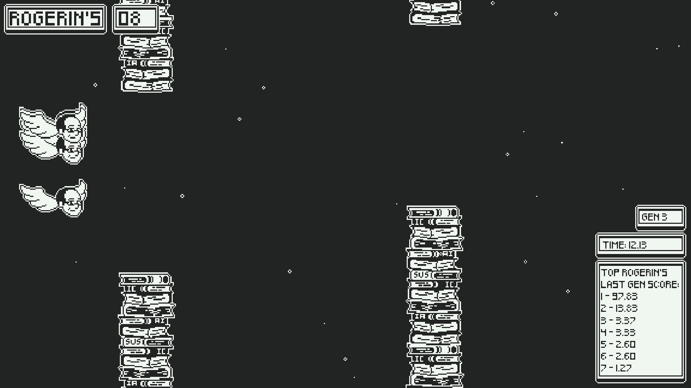

# Projetos de jogos

## Programação
Projetos que participei ativamente do código (e/ou arte)

### TP1 CG: Kensei.io

[Youtube Video](https://youtu.be/j9GwHRilnDM) | [Git](https://github.com/antonioaads/TP1) | OpenGL; SDL

### TP2 CG: Casa na árvore

[Youtube Video](https://youtu.be/AjdKNrXoPJ0) | [Git](https://github.com/rodrigodmoreira/TP2) | OpenGL; SDL

### TP1 Jogos Digitais: Super Gado Bros

[Youtube Video](https://youtu.be/HXyjNeyWHzQ) | [Git]() | Unity

### Monmusu Slash

[Youtube Video](https://youtu.be/ucVdUnChLr0) | [Git](https://github.com/rodrigodmoreira/pico-8) | Pico-8

### TP Web: HTML Hero

[Youtube Video](https://youtu.be/Es8rApcf6xU) | [Git](https://github.com/rodrigodmoreira/cefet-web-weblot/tree/2021/01) | HTML/Javascript

### TP Final IC: Rogerin's Flight

[Youtube Video](https://youtu.be/upqmSKaf2uI) | [Git](https://github.com/rodrigodmoreira/gdnn_flapbird) | Godot

## Arte
Projetos em que participei apenas como artista (pixel-art)

### SoundWay

[Jogo](http://mundodafono.com.br/soundway.html)

### Santa Cruz Steel (em desenvolvimento)

